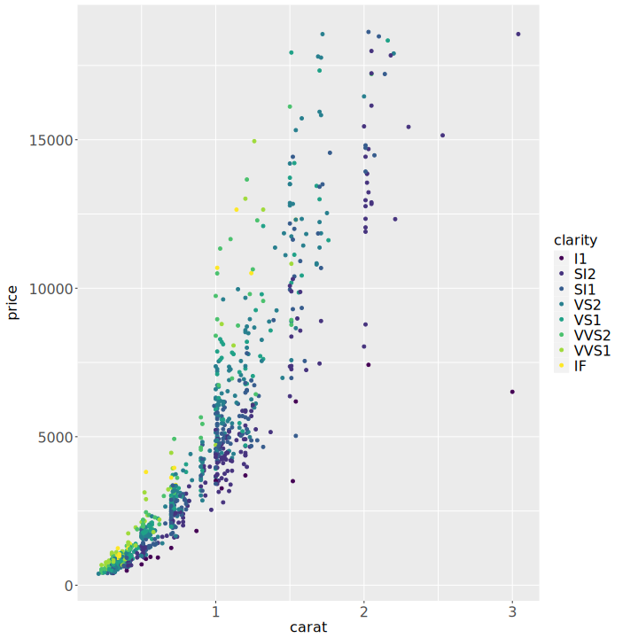

<!-- README.md is generated from README.Rmd. Please edit that file -->

# extendrSVGdevice

<!-- badges: start -->
<!-- badges: end -->

A Rust-implementation of [devout’s tutorial to create an SVG graphic
device](https://coolbutuseless.github.io/package/devout/articles/creating-an-svg-device-01.html).

``` r
library(extendrSVGdevice)
library(ggplot2)

file <- knitr::fig_path('.svg')
extendr_svg(file, 10, 10)

dsamp <- diamonds[sample(nrow(diamonds), 1000), ]
ggplot(dsamp, aes(carat, price)) +
  geom_point(aes(colour = clarity))

dev.off()
#> png 
#>   2

knitr::include_graphics(file)
```


